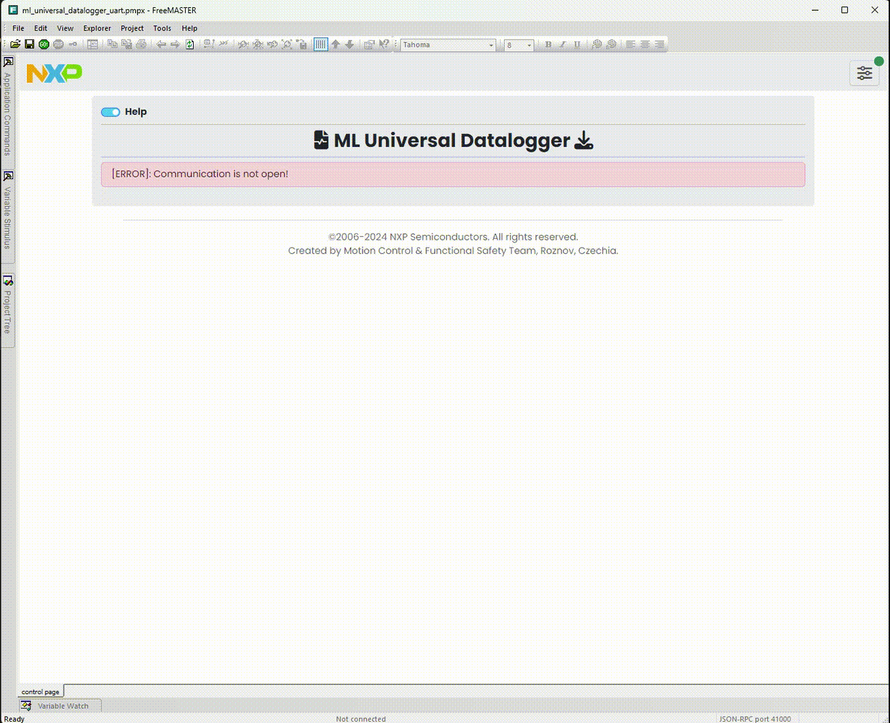
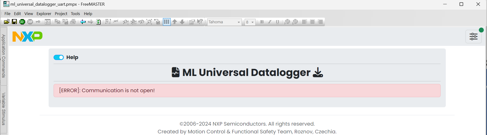
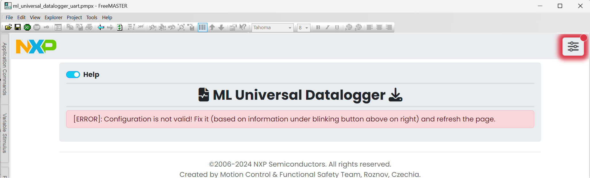
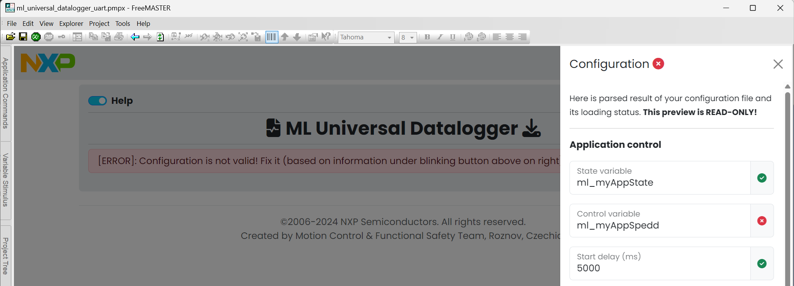

# NXP Application Code Hub
[](https://www.nxp.com)

## ML Universal Datalogger for FreeMASTER
This software allows the user to perform tests and record data on any FreeMASTER-enabled MCU by automatically running user-implemented scenarios on the MCU side.


The ML Universal Datalogger is an automated datalogger application implemented in JavaScript language as a control page in the FreeMASTER. It works in a way the FreeMASTER application controls the user-implemented measurement scenario in C language on the MCU board. The measurement status is reported by a progress variable which is controlled by the C code by the user. It allows the user to perform the time consuming measurements or software tests automatically via simple single page GUI and few lines of code in the C project.

### Fields of application
- Acquirement of time series data
    - Dataset collection for machine learning algorithms
- Time-consuming measurements/tests which require a lot of repeats
    - Scenarios automation (It is not necessary to collect the data)
- Fast-paced applications with very limited time to save the data
    - Realtime applications where is no time to transmit the data

### Output file and supported variables
Basically, any data which you can serialize to bytes are supported. You can download multiple variables (single or arrays) with different length and they will be automatically recognized, downloaded and exported to CSV file. Rows of variables with shorter length than the other will be left blank. **Data are saved to file with CSV extension, but are delimited by TAB character.**

#### Boards: FRDM-MCXN947, Custom Board
#### Categories: AI/ML, Tools
#### Peripherals: UART
#### Toolchains: MCUXpresso IDE

## Table of Contents
1. [Software](#step1)
2. [Hardware](#step2)
3. [Setup](#step3)
4. [Results](#step4)
5. [FAQs](#step5) 
6. [Support](#step6)
7. [Release Notes](#step7)

## 1. Software<a name="step1"></a>
- FreeMASTER application provided by this package - FreeMASTER project (JavaScript application) for automation of scenarios implemented on MCU by the user
    - Folder `freemaster_project`
        - `ml_universal_datalogger_pdbdm.pmpx` - FreeMASTER project with PD-BDM ready connection
        - `ml_universal_datalogger_uart.pmpx` - FreeMASTER project with UART ready connection
        - `configuration.xml` - Example configuration file for the datalogger

- MCU applications provided by this package - MCUXpresso example projects with UART and PD-BDM ready FreeMASTER communication (both for FRDM-MCXN947)
    - Folder `frdmmcxn947_mlud_cproject_pdbdm` - MCUXpresso C project with PD-BDM ready connection
    - Folder `frdmmcxn947_mlud_cproject_uart` - MCUXpresso C project with UART ready connection

- C files for implement MCUXpresso project from scratch
    - Folder `c_files_only`

**Toolchain:**
- MCUXpresso SDK (revision [MCUX_2.14.0](https://github.com/nxp-mcuxpresso/mcux-sdk/tree/MCUX_2.14.0_MCXNx4x))
- MCUXpresso IDE
- FreeMASTER (tested with version 3.2.3)

## 2. Hardware<a name="step2"></a>
**Required:**
- Personal Computer 
- Any FreeMASTER-enabled board with corresponding USB cable

## 3. Setup<a name="step3"></a>

This setup is for implement the MCUXpresso project from the scratch (using files in folder `c_files_only`) and connect it with FreeMASTER project from folder `freemaster_project`.

### Board
- Install the FreeMASTER component from the SDK
    - Ensure you have enabled all the necessary pins, clocks and peripheries regarding your transmission modality (UART, PDBDM)
- Include `ml_universal_datalogger.h` and `ml_universal_datalogger.c` into your project
- Implement your scenario with datalogger in mind
    - Optionally install the RTCESL from the SDK (for the support of MLIB datatypes, especially fractional datatypes for saving the memory consumption)
- Build and load the project to the board (do not forget to continue run if you debug the project since the communication is blocked)
    - Possible problem solutions
        - Are your `BOARD_Init` functions called?
        - Is your `freemaster_cfg.h` file correct?

### User scenario

#### 1) Include header file
```
# include "ml_universal_datalogger.h"
```

#### 2) Initialize datalogger
Initialize datalogger with the total progress value. If you collect the data to a buffer it is convenient to initialize the datalogger with buffer size.
```
MLUD_Initialize(ML_READ_BUFFER_TOTAL_SIZE);
```

#### 3) Call sampling function
Call the datalogger sampling function in a place where the sampling should occur, the `MLUD_UserScenario` function will be then called through it internally. For example in a timer interrupt. 
```
void LPTMR0_IRQHandler(void)
{
	// Clear timer interrupt flag
	LPTMR_ClearStatusFlags(LPTMR0, kLPTMR_TimerCompareFlag);

	// Handle timer event internally and let user know via callback functions
	MLUD_HandleSamplingEvent();
}
```

#### 4) Define clean up function
Implement/define the user clean up function (externally declared in datalogger library) to reset all of your variables before the new measurement starts.
```
void MLUD_UserCleanUp(void)
{
    // Clear buffer by setting index to zero
	ml_bufferIndex = 0;
}
```

#### 5) Define user scenario function
Implement/define the user scenario function (externally declared in datalogger library) to be executed during each measurement. The return value of this function is actual progress value of the measurement. When the return value is equal or higher than the initialized total progress value (in this example code it is `ML_READ_BUFFER_TOTAL_SIZE`), the measurement will be finished and the data download will be initiated. 
```
uint32_t MLUD_UserScenario(void)
{
	// If app is enabled
	if (ml_myAppState == ML_MYAPP_STATE_ON)
	{
		// If buffer is not full
		if(ml_bufferIndex < ML_READ_BUFFER_TOTAL_SIZE)
		{
			// Save data to buffers
			ml_xBuffer[ml_bufferIndex] = ml_myAppSpeed;
			ml_yBuffer[ml_bufferIndex] = MLIB_ConvSc_F16ff_FAsmi(ml_myAppSpeed, 1000.0F);

			// Increment buffer (and update progress)
			ml_bufferIndex++;
		}
	}

	// Return current progress value (in this case it is buffer size)
	return ml_bufferIndex;
}
```
You can use flag variables to signalize specific situations which should be measured, e.g. specific speed of motor, signal peak, etc. In this example, the state of application is used as flag (`ml_myAppState`). You can also save single variables, e.g. states, timestamps or indices pointing to specific sample in array, etc. **Otherwise you do not need to save data at all and use the datalogger as automation tool, however you MUST report progress as return value of `MLUD_UserScenario` function every time!**

#### 6) Scenario on MCU side is ready
Everything else is then handled by the datalogger library via FreeMASTER application. You just need to build the project, load it to the board and link the AXF/MAP file to the FreeMASTER (It is necessary only once if you do not change the locations of the C project and the FreeMASTER project).

### FreeMASTER
- Open the FreeMASTER project (`ml_universal_datalogger_pdbdm.pmpx` or `ml_universal_datalogger_uart.pmpx`)
    - There are the UART and PDBDM sample C projects for the FRDM-MCXN947 board
- Setup the communication with the board
    - The UART project is board independent, only the AXF/MAP file path must be changed
    - The PDBDM project is board specific and communication must be set up for every board specifically
- Set path to the AXF/MAP file to your current project
- Connect to the board and reload the page
    - Possible problem solutions
        - Make sure you have linked the correct AXF/MAP file in FreeMASTER project!
        - Using the serial connection, are all the baud rates included in the search? By default the baud rate of 115200 is used.
        - Using the PD-BDM connection, do you have the correct board and addresses set?

### Usage
If you have your scenario ready on the board, you can open the FreeMASTER project and continue from there. Once the communication is set up, it is necessary to prepare the configuration file.

## Configuration file
Configuration file contains the information about export file, measurement and application. You can use configuration file (`freemaster_project/configuration.xml`) from example project.

### Structure overview
Legend: | `[t]` = Tag | `[a]` = Attribute | `[o]` = Optional tag |
|:---:|:---:|:---:|:---:|

- `[t]` ***configuration*** - Main configuration tag
    - `[t]` ***file*** - Information about the measurement progress (updated also by the datalogger application)
        - `[t]` ***folder***
            - `[a]` ***value*** - Target folder for the measurement files (the folder must exists)
        - `[t]` ***prefix***
            - `[a]` ***value*** - Name of the file without counter value
        - `[t]` ***offset***
            - `[a]` ***value*** - Offset value for the file counter

    - `[t]` ***app*** - Information about the application on MCU
        - `[t][o]` ***stateVariable*** - A variable signilizing state of the app
            - `[a]` ***symbol*** - Name of the variable on MCU
            - `[a]` ***faultValue*** - A value signalizing fault of the app
        - `[t][o]` ***controlVariable*** - A variable signilizing control value of the app
            - `[a]` ***symbol*** - Name of the variable on MCU
            - `[a]` ***unit*** - A unit of the variable
        - `[t]` ***startSequence*** - List of the variables and its values to start the app
            - `[t][o]` ***variable*** - A variable to be changed in order to start the app (You can add more than one)
                - `[a]` ***symbol*** - Name of the variable on MCU or in FreeMASTER
                - `[a]` ***value*** - A value of the variable
        - `[t]` ***stopSequence*** - List of the variables and their values to stop the app
            - `[t][o]` ***variable*** - A variable to be changed in order to stop the app (You can add more than one)
                - `[a]` ***symbol*** - Name of the variable on MCU or in FreeMASTER
                - `[a]` ***value*** - A value of the variable
        - `[t]` ***startDelayMs***
            - `[a]` ***value*** - Delay in miliseconds before the measurement starts after the start sequence

    - `[t]` ***measurement*** - Information about the measurement variables
        - `[t]` ***variables*** - List of the variables to be downloaded and saved
            - `[t][o]` ***variable*** - A variable to be downloaded and saved in CSV file
                - `[a]` ***symbol*** - Name of the variable on MCU
                - `[a]` ***name*** - Header name of the variable in CSV file

### Example configuration file
```
<configuration>
  <!--File export-->
  <file>
    <folder value="measured_data"/>
    <prefix value="class_x_y_"/>
    <offset value="1"/>
    <paddingZerosCount value="6"/>
  </file>

  <!--Application control-->
  <app>
    <!--Variable containing the application status-->
    <stateVariable symbol="ml_myAppState" faultValue="2"/>
    <!--Variable containing the actual control value (e.g. speed of motor)-->
    <controlVariable symbol="ml_myAppSpeed" unit="RPM"/>
    <!--Variables and their values to be executed in order to start application-->
    <startSequence>
      <variable symbol="ml_myAppState" value="1"/>
    </startSequence>
    <!--Variables and their values to be executed in order to stop application-->
    <stopSequence>
      <variable symbol="ml_myAppState" value="0"/>
    </stopSequence>
    <!--Delay between application start and beginning of measurement-->
    <startDelayMs value="5000"/>
  </app>

  <!--Measurement control-->
  <measurement>
    <!--Variables to be downloaded and their name in CSV file-->
    <variables>
      <variable symbol="ml_xBuffer" name="x"/>
      <variable symbol="ml_yBuffer" name="y"/>
    </variables>
  </measurement>
</configuration>
```
## 4. Results<a name="step4"></a>

The preview below features demo scenario where 2 seconds (2000 samples with 1kHz sampling rate) of a signal is being recorded after the application was started on MCU. The datalogger also waits 2 seconds after application was started before the measurement was initiated (as stabilization of signal, e.g. after motor was run). You can also see the configuration preview, where you can check if everything was loaded correctly. The emergency stop button feature which allows user to initiate stop sequence immediately when something unexpected happen (e.g. the motor gets stuck) is previewed there as well. The emergency stop button initiates a fault condition of the datalogger, which results in the currently measured data are not being saved!



## 5. FAQs<a name="step5"></a>

### There is no total progress value
- Make sure you reloaded page after device was connected!

### The error below is shown when FreeMASTER application is not connected to board or communication timed-out
- Make sure you are not in debug session in MCUXpresso project.
- Make sure you enabled all pins, peripheries and clocks and also called their initialization via BOARD_Init functions.



### The error below is shown when your configuration file has incorrect variables
- Make sure your variables are spelled correctly and are used in your project (compiler can remove unused variables during optimization).



- You can see what is wrong in configuration preview below.




## 6. Support<a name="step6"></a>
Please refer to the following resources list for extended support:
- [FreeMASTER](https://www.nxp.com/design/design-center/software/development-software/freemaster-run-time-debugging-tool:FREEMASTER) - Official page of FreeMASTER application
- [MCUXpresso SDK](https://github.com/NXPmicro/mcux-sdk/) - Full SDK delivery that provides access to other SDK examples and components

#### Project Metadata

<!----- Boards ----->
[]()

<!----- Categories ----->
[](https://github.com/search?q=org%3Anxp-appcodehub+aiml+in%3Areadme&type=Repositories)
[](https://github.com/search?q=org%3Anxp-appcodehub+tools+in%3Areadme&type=Repositories)

<!----- Peripherals ----->
[](https://github.com/search?q=org%3Anxp-appcodehub+uart+in%3Areadme&type=Repositories)

<!----- Toolchains ----->
[](https://github.com/search?q=org%3Anxp-appcodehub+mcux+in%3Areadme&type=Repositories)

Questions regarding the content/correctness of this example can be entered as Issues within this GitHub repository.

>**Warning**: For more general technical questions regarding NXP Microcontrollers and the difference in expected functionality, enter your questions on the [NXP Community Forum](https://community.nxp.com/)

[](https://www.youtube.com/NXP_Semiconductors)
[](https://www.linkedin.com/company/nxp-semiconductors)
[](https://www.facebook.com/nxpsemi/)
[](https://x.com/NXP)

## 7. Release Notes<a name="step7"></a>
| Version | Description / Update                           | Date                        |
|:-------:|------------------------------------------------|----------------------------:|
| 1.0     | Initial release on Application Code Hub        | October 2<sup>nd</sup> 2024 |